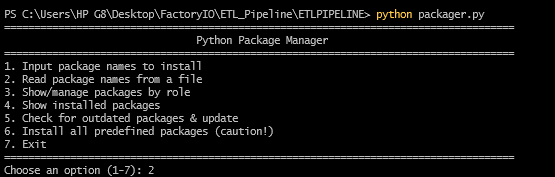

# ETL-Sales-Pipeline — Setup & Full Documentation

**ETL Sales Pipeline** is a mini data engineering project that extracts raw sales data from CSV, transforms it with cleaning and total calculations, and loads it into a SQLite database. It provides a **REST API** for real-time CRUD operations and a **CLI tool** for easy navigation, updates, exports, and reporting.

This project demonstrates core **Data Engineering** concepts:
 Extract → Transform → Load
 Database integration
 REST API development
 CLI-based interaction & automation

---

##  Features

###  ETL Pipeline (Python + Pandas + SQLite)

* Load and clean **CSV sales data**

 
 
* Calculate `total_price` = `quantity × unit_price`
* Store data in a relational database

  

###  Flask REST API

* **GET** `/sales` → Fetch all sales
* **GET** `/sales/<customer_id>` → Fetch sales by customer
* **POST** `/sales` → Add a new sale
* **PUT** `/sales/<customer_id>` → Update existing sale
* **DELETE** `/sales/<customer_id>` → Delete sale
* **GET** `/sales/export/<csv|excel>` → Export sales data

###  CLI Tool (`etl_tool.py`)


* Interactive API client with features:

  1. GET all sales
  2. GET sale by `customer_id`
  3. POST (add new sale)
  4. PUT (update sale by `customer_id`)
  5. DELETE sale by `customer_id`
  6. Export sales (CSV or Excel)

###  Package Manager (`packager.py`)



* Install Python dependencies
* Manage package collections
* Check outdated packages & update

---

##  Tech Stack

**Languages**

* Python 3
* PowerShell
* Batch (CMD)

**Python Packages**

* `pandas` → Data cleaning & transformation
* `flask` → REST API
* `sqlite3` → Database
* `requests` → API requests (CLI tool)
* `tabulate` → Pretty table output in CLI
* `colorama` → Colored terminal output

**External Tools**

* `Invoke-WebRequest` (PowerShell) → API client
* `curl` (CMD) → API client
---

##  Project Structure

```
ETL-Sales-Pipeline/
│── etl_pipeline.py        # Main ETL pipeline (Extract → Transform → Load + Server trigger)
│── server-sideAPI.py      # Flask REST API
│── etl_tool.py            # CLI manager for sales database
│── etl_tool.ps1           # Powershell manager for sales database
│── packager.py            # Package manager utility
│── sales.csv              # Source data (raw sales)
│── sales.db               # SQLite database (auto-generated)
│── packages.txt           # Required dependencies
│── tStyle.py              # Consistant Formatting
```

---

##  Setup & Run

### 1️⃣ Install Dependencies

1. Open **`packager.py`**.
2. Run the script:

   ```bash
   python packager.py
   ```
3. In the menu, select **option 2** → Install packages from file.
4. Ensure you have a `packages.txt` file listing all required dependencies.

   

---

### 2️⃣ Run the ETL Pipeline

Run via PowerShell, CMD, or IDE:

```bash
python etl_pipeline.py
```


The pipeline:

* Extract and clean data from `sales.csv`
* Compute `total_price`
* Load the data into `sales.db` (SQLite database)
* Start the **Flask API server** automatically

---

### 3️⃣ Access the Server

* Open in browser:
   [http://127.0.0.1:5000/sales](http://127.0.0.1:5000/sales)

  

* Or run the CLI tool:

  ```bash
  python etl_tool.py


  
```

##  SQL Queries & Their Roles
```
### 1. Insert a new sale


```sql
INSERT INTO sales (date, customer_id, product, quantity, unit_price, total_price)
VALUES (?, ?, ?, ?, ?, ?);
```

**Role:** Adds new sales records (`POST`).

### 2. Retrieve all sales


```sql
SELECT * FROM sales;
```

**Role:** Extracts all sales data (`GET all sales`).

### 3. Retrieve sales by customer ID

```sql
SELECT * FROM sales WHERE customer_id = ?;
```

**Role:** Fetches sales specific to a customer (`GET by customer_id`).

### 4. Update a sale

```sql
UPDATE sales
SET quantity = ?, unit_price = ?, total_price = quantity * unit_price
WHERE customer_id = ?;
```

**Role:** Updates sales records (`PUT`).

### 5. Delete a sale

```sql
DELETE FROM sales WHERE customer_id = ?;
```

**Role:** Deletes records (`DELETE`).

### 6. Aggregation query (reporting)

```sql
SELECT product, SUM(quantity) AS total_sold, SUM(total_price) AS revenue
FROM sales
GROUP BY product;
```

**Role:** Generates sales summaries per product (analytics/reporting).

---

##  ETL Workflow

1. **Extract** → CSV data is read into Pandas.
2. **Transform** → Data cleaned (drop missing IDs, convert dates, calculate `total_price`).
3. **Load** → Transformed data is written into SQLite (`sales.db`).
4. **API Layer** → Flask server exposes CRUD + export endpoints.
5. **Manage Data** → Use `etl_tool.py` or direct API calls (PowerShell / curl / Postman).

⚠️ **Note:** The database cannot be accessed if the Flask server is **off**.

---

##  Example Workflow

1. Install packages with `packager.py` (option 2 → from file).


   
2. Run `etl_pipeline.py` → process data + start API server.


   
3. Manage sales via `etl_tool.py`
   


   or
 [http://127.0.0.1:5000/sales](http://127.0.0.1:5000/sales).

 

4. Perform CRUD + export.


5. Server Logs.
   


---

##  Conclusion

* **Python + Pandas** handle ETL.
* **SQLite** stores structured sales data.
* **Flask API** enables CRUD & exports.
* **CLI Tool** simplifies database management.

This makes the ETL-Sales-Pipeline a **complete educational project** showcasing modern data engineering practices.
